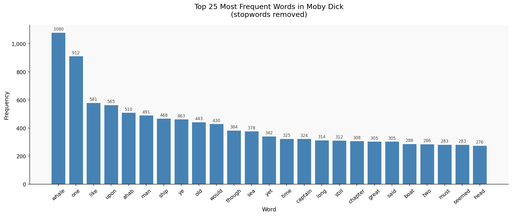
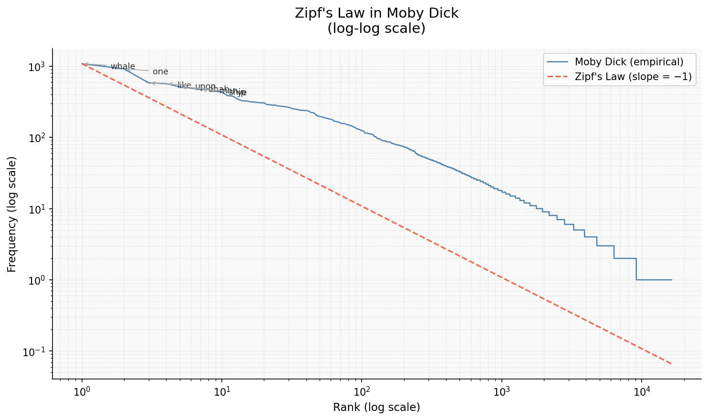

# NLP Literary Analysis — Word Frequency & Zipf's Law

A beginner NLP project analysing Herman Melville's *Moby Dick* using Python and NLTK.

## What this covers

- Scraping plain text from Project Gutenberg
- Text cleaning and normalisation
- Tokenisation with NLTK
- Stopword removal
- Frequency distribution (top-N words)
- Zipf's Law verification on a real corpus

## Setup

```bash
# 1. Clone or download this project
# 2. Create a virtual environment (recommended)
python3 -m venv venv
source venv/bin/activate        # Windows: venv\Scripts\activate

# 3. Install dependencies
pip install -r requirements.txt

# 4. Launch Jupyter
jupyter notebook analysis.ipynb
```

## Output

Running all cells produces the following visualisations:

### Top Words
Bar chart of the 25 most frequent words:



### Zipf's Law
Log-log Zipf's Law plot with the empirical Zipf line overlaid:



## Extending the project

Change `GUTENBERG_URL` in cell 2 to any other Project Gutenberg `.txt` URL to run the
same analysis on a different book. The full catalogue is at https://www.gutenberg.org
